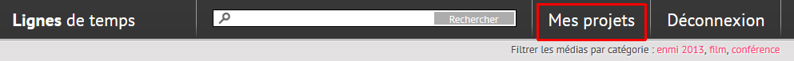
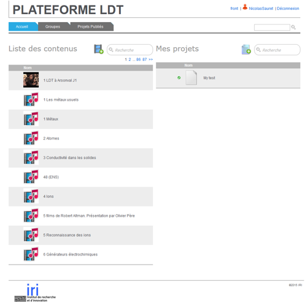
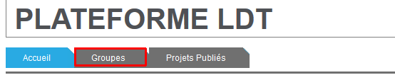
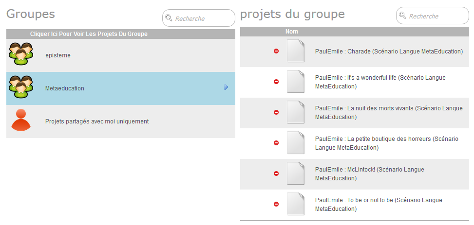

# Accès à l'outil d'annotation vidéo

L'outil est actuellement disponible sur la plateforme Ligne de temps actuelle. Nous avons créé un *groupe de travail* dédié "MetaEducation" sur lequel vous pouvez créer des projets d'annotation à partir des contenus disponibles.

Note: Vous devez vous authentifier pour accéder à l'outil. Un mail d'invitation vous sera envoyé avec votre login et mot de passe. Tous les participants à l'expérimentation feront parti du groupe *MetaEducation*.

Attention: Cet outil ne pourra pas être déployé auprès des élèves en phase 2, mais vos tests et retours d'expérience seront précieux pour orienter la  réalisation d'une nouvelle plateforme d'annotation vidéo, qui sera mise en service auprès des élèves pour la troisième phase des expérimentations.

---

### Connexion

<i class="fa fa-arrow-right"></i> **[Pour se connecter à l'outil d'annotation](http://ldt.iri.centrepompidou.fr/ldtplatform/accounts/login/)**

Une fois connecté, cliquez sur ***Mes Projets*** :

L'écran est alors séparé en deux verticalement :

* à gauche : la liste des contenus vidéo disponibles
* à droite : la liste de vos projets d'annotation (liste vide lorsque vous vous connectez pour la première fois).

---

### Annoter

Référez-vous au [tutoriel de l'outil](tuto_annot.md) pour :

* créer un projet d'annotation à partir d'une vidéo
* démarrer l'annotation d'un projet
* dupliquer un projet existant
* éditer un projet existant
* etc.

---

### Groupe MetaEducation

Pour accéder à l'espace du groupe *MetaEducation*, cliquez sur l'onglet ***Groupes*** :

Puis, dans la liste des groupes, cliquez sur le groupe ***MetaEducation*** :

Vous pouvez alors accéder à la liste des projets déjà créés par le groupe :

Dans cet espace, vous retrouvez notamment le projet *Charade* préparé par Paul-Emile, ainsi que ses différents projets associés aux 6 films mis à disposition :

* Night of the living Dead
* Charade
* McLintock!
* The Little Shop of Horrors
* To be or not to be
* La vie est belle
