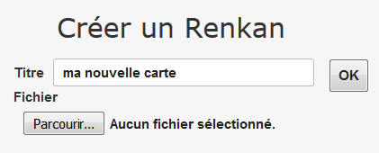
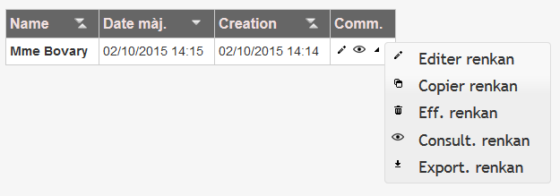

## Accès à l'outil de carte mentale

L'outil est actuellement disponible dans une version prototype sur une plateforme de test. Nous avons créé un espace dédié MetaEducation sur lequel vous pouvez créer et générer vos propre cartes.

Note: sur cette plateforme, une carte mentale est appelée ***Renkan***.

Attention: Aucune connexion n'est nécessaire sur cette plateforme. **Merci de respecter les productions de vos collègues.**
Pour la phase 2 des expérimentations avec les élèves, une plateforme dédiée sera mise en place avec authentification.

<i class="fa fa-arrow-right"></i> **[Espace MetaEducation](http://renkan.iri-research.org/renkan/s/431b537f-6907-11e5-9c79-df1f6aaa03d9)**

Dans cet espace, vous retrouvez la carte *Madame Bovary*.

---
Pour créer une nouvelle carte, entrez le titre de la carte dans le champs et cliquez sur OK. 

---
Dans la liste des cartes créées, le menu permet d'effectuer des actions simples sur les cartes&nbsp;:

* **éditer une carte :** ouvre la carte en édition
* **copier une carte :** duplique la carte pour ne pas altérer l'originale par exemple
* **effacer une carte :** supprime définitivement la carte
* **consulter une carte :** ouvre la carte en lecture
* **exporter une carte :** permet de télécharger la carte dans un fichier JSON.

