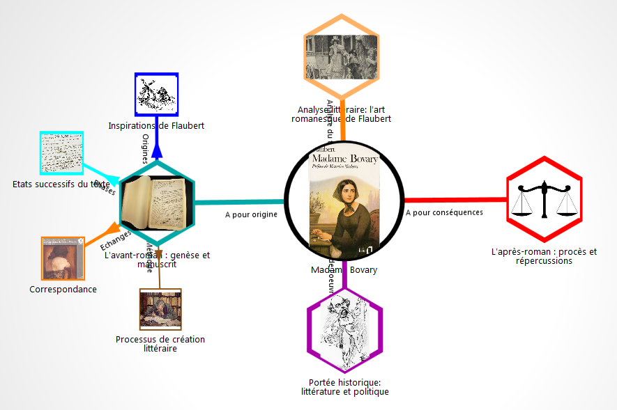

# Outil de carte mentale

##Intro

L'usage des cartes mentales a déjà largement pénétré les classes de collège et lycée. L'outil de carte mentale proposé ici a la particularité de facilement agréger des ressources du web, et plus spécifiquement les ressources de la GED (banque de ressource) de MetaEducation. Le scénario pédagogique proposé à titre d'exemple s'appuie sur l'oeuvre de Gustave Flaubert, *Madame Bovary*, au programme de Français en classe de 1ère.

Hint: Vous pouvez télécharger la présentation du scénario depuis le groupe de travail dédié : [partage de document]

## Scénario *Madame Bovary*

<iframe src="https://docs.google.com/presentation/d/1Eif0Pq4i2Qck6VZuEl6EPIYFj8ZM3T0SMq3gLR5rEZ4/embed?start=false&loop=false&delayms=5000" frameborder="0" width="640" height="389" allowfullscreen="true" mozallowfullscreen="true" webkitallowfullscreen="true"></iframe>

[partage de document]:
